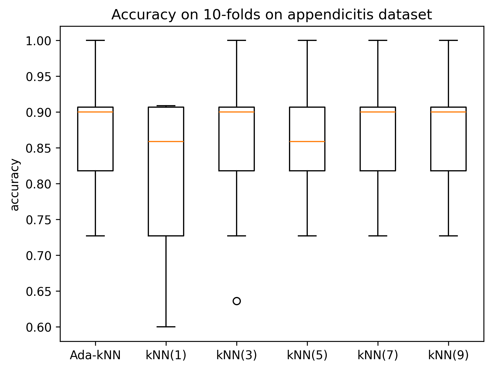
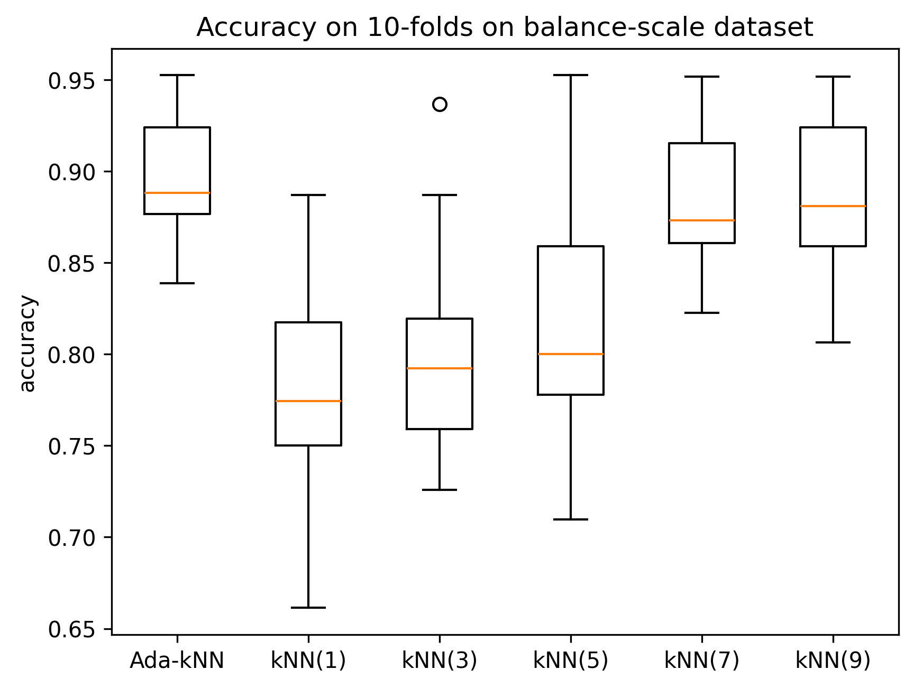
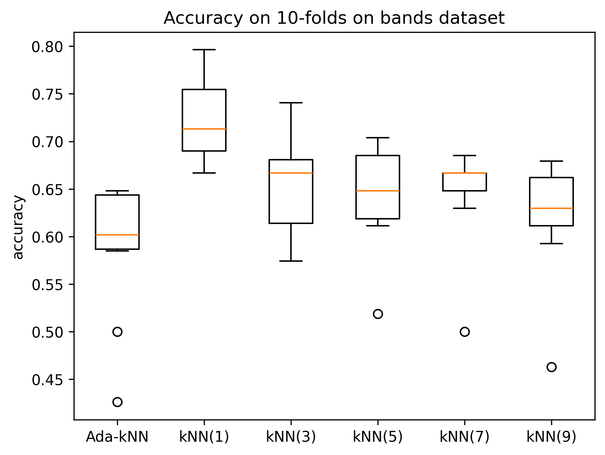
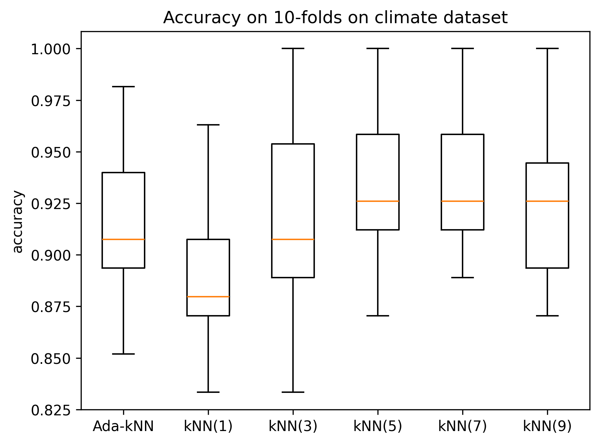
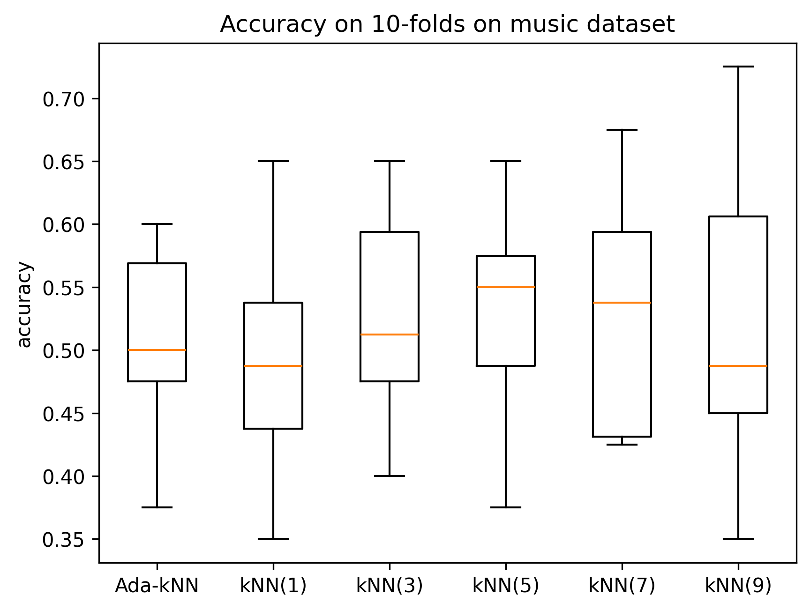
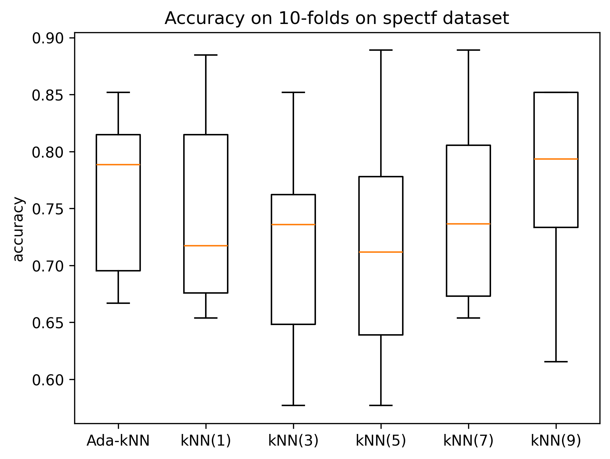

# Ada-kNN-Python
This is a python implementation of the Ada-kNN classifier, proposed by [Mullick et al.](https://ieeexplore.ieee.org/abstract/document/8326728)
## Classifier description
The classifier is an extension of kNN, in which a strategy based on Multi-layer perceptron (MLP) is proposed to automate the choice of the parameter k, for each instance to be classified.

The operation of Ada-kNN is described bellow:
- First, for each instance $x_i$ in the training set, a series of experiments are performed to identify the $k$ values which correctly classify $x_i$ with kNN.
- With this information, a MLP architecture is trained to predict the most appropriate $k$ value for classifying a given instance based on their attribute values.
- Once the neural network has been trained, for each instance to be classified, the most appropriate value of $k$ is predicted with this network, then a conventional kNN classifier performs a prediction with this value.

## Installation
Clone this repository:
```bash
git clone git@github.com:daniel-lima-lopez/Ada-kNN-Python.git
```
move to instalation directory:
```bash
cd Ada-kNN-Python
```

## Basic usage
The classifier can be used without specifying any value:
```python
import Ada_kNN as ada
classifier = ada.Ada_kNN()
```
However, the training parameters can be modified:
- `alpha`: number of experiments consdiered on $X_{test}$
- `lr` (0.01): learning rate for MLP traning
- `batch_size` (4): batch size for MLP traning
- `epochs` (100): number of epochs for MLP traning

Once instantiated the classifier, we can perform a simple test:
```python
import pandas as pd
from sklearn.model_selection import train_test_split
from sklearn.metrics import accuracy_score

# data preapration
dataset = pd.read_csv('Datasets/wine.csv')
Xs = dataset.drop('class', axis=1).values
ys = dataset['class'].values

# data split
X_train, X_test, y_train, y_test = train_test_split(Xs, ys, test_size=0.2, random_state=2) #12

# fit the classifier
classifier.fit(X_train, y_train)

# predictions on test set
preds = classifier.predict(X_test)
print(f'accuracy: {accuracy_score(y_true=y_test, y_pred=preds)}')
```

## Experiments
Experiments were conducted to compare the performance of Ada-kNN with kNN. On each experiment, a 10-fold cross-validation was performed. For kNN, the `k` values considered are 1, 3, 5, 7, and 9. The accuracy on datasets appendicitis, balance-scale, bandas, climate, music and spectf are presented on the following figures:







